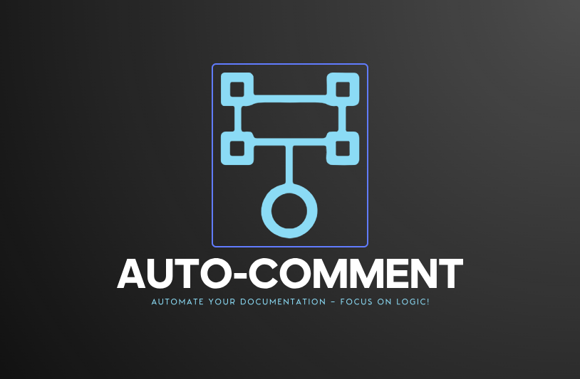

<!-- Improved compatibility of Forgot something link: See: https://github.com/othneildrew/Best-README-Template/pull/73 -->
<a id="readme-top"></a>
<!--
*** Thanks for checking out the Best-README-Template. If you have a suggestion
*** that would make this better, please fork the repo and create a pull request
*** or simply open an issue with the tag "enhancement".
*** Don't forget to give the project a star!
*** Thanks again! Now go create something AMAZING! :D
-->


<!-- PROJECT SHIELDS -->
<!--
*** I'm using markdown "reference style" links for readability.
*** Reference links are enclosed in brackets [ ] instead of parentheses ( ).
*** See the bottom of this document for the declaration of the reference variables
*** for contributors-url, forks-url, etc. This is an optional, concise syntax you may use.
*** https://www.markdownguide.org/basic-syntax/#reference-style-links
-->
<!-- [![Contributors][contributors-shield]][contributors-url]
[![Forks][forks-shield]][forks-url]
[![Stargazers][stars-shield]][stars-url]
[![Issues][issues-shield]][issues-url]
[![project_license][license-shield]][license-url] -->

[![LinkedIn][linkedin-shield]][linkedin-url]


<!-- PROJECT LOGO -->
<br />
<div align="center">
  <a href="https://github.com/idkmanan/Auto-Comment">
    
  </a>

  <h3 align="center">Auto-Comment</h3>

  <p align="center">
    Automate Your Documentation – Focus on Logic!
    <br />
    <a href="https://github.com/idkmanan/Auto-Comment"><strong>Explore the docs »</strong></a>
    <br />
  </p>
</div>

<!-- TABLE OF CONTENTS -->
<details>
  <summary>Table of Contents</summary>
  <ol>
    <li>
      <a href="#about-the-project">About The Project</a>
      <ul>
        <li><a href="#built-with">Built With</a></li>
      </ul>
    </li>
    <li>
      <a href="#getting-started">Getting Started</a>
      <ul>
        <li><a href="#installation">Installation</a></li>
      </ul>
    </li>
    <li><a href="#usage">Usage</a></li>
  </ol>
</details>


<!-- ABOUT THE PROJECT -->
## About The Project

Auto-Comment is a powerful VS Code extension designed to automatically generate comments for your code, saving you time and improving documentation consistency.

Whether you're working on solo projects, team collaborations, or open-source contributions, maintaining clear and structured comments is crucial—but writing them manually can be tedious.

<p align="right">(<a href="#readme-top">Forgot something</a>)🔝</p>


### Built With

* [![Node][Node.js]][Node-url]
* [![JavaScript][javascr.js]][javascr-url]
* [![Vscode][Vscode.js]][Vscode-url]

<p align="right"><a href="#readme-top">Forgot something</a>🔝</p>


<!-- GETTING STARTED -->
## Getting Started

✨ Never Lose Context Again! This extension automatically generates clear, concise comments for your code, ensuring developers (and future you 😉) understand it even after an eternity.


### Installation

1. Install the extension from [VS Code Marketplace][Vsmarket-url]

2. Ensure [![Ollama][Ollama.io]][Ollama-url] is installed.

3.  Download your preferred model:
   ```sh
   ollama run qwen3:0.6b
   ```
4. Alternativelly you can download any model and change the config int the package.json
   ```sh
   "properties": {
      "autocomment.model": {
        "type": "string",
        "default": "qwen:0.5b",
        "description": "Model to use for generating comments (e.g., qwen:0.5b, deepseek-r1:latest, wizardlm2:latest, qwen3:0.6b)"
      }
    }
    ```

<p align="right">(<a href="#readme-top">Forgot something</a>)🔝</p>


<!-- USAGE EXAMPLES -->
## Usage

[![Product Name Screen Shot][product-screenshot]](https://example.com)

✨ Generate Smart Code Comments in 3 Easy Steps!

1. 📌 Set Your Preferred AI Model

* Press Ctrl+Shift+P (or Cmd+Shift+P on Mac)

* Search and select "Set Model"

* Choose any model (e.g., llama3, mistral, deepseek-r1)
    → Ensure the model is downloaded via Ollama first!
    ```sh
    ollama pull [model-name]  # Example: `ollama pull llama3`
    ```

2. 👩‍💻 Select Code to Document

* Highlight any line(s) of code

* Press Ctrl+Shift+P again

* Search and select "Auto Comment"

3. 💡 Enjoy AI-Generated Documentation!

* A comment will appear automatically

* For quick insertion, just type // and accept the suggestion

<p align="right">(<a href="#readme-top">Forgot something</a>)🔝</p>

<!-- MARKDOWN LINKS & IMAGES -->
<!-- https://www.markdownguide.org/basic-syntax/#reference-style-links -->
[linkedin-shield]: https://img.shields.io/badge/-LinkedIn-black.svg?style=for-the-badge&logo=linkedin&colorB=555
[linkedin-url]: https://www.linkedin.com/in/manan-agg005/
[product-screenshot]: images/auto-comment.gif
[Node.js]: https://img.shields.io/badge/Node.js-339933?style=for-the-badge&logo=nodedotjs&logoColor=white
[Node-url]: https://nodejs.org/
[javascr.js]: https://img.shields.io/badge/JavaScript-F7DF1E?style=for-the-badge&logo=javascript&logoColor=black
[javascr-url]: https://developer.mozilla.org/en-US/docs/Web/JavaScript
[Vscode.js]: https://img.shields.io/badge/VS_Code-007ACC?style=for-the-badge&logo=visualstudiocode&logoColor=white
[Vscode-url]: https://code.visualstudio.com/api
[Ollama.io]: https://img.shields.io/badge/Ollama-7C4DFF?style=for-the-badge&logo=ollama&logoColor=white
[Ollama-url]: https://ollama.com/download
[Vsmarket-url]: https://marketplace.visualstudio.com/vscode